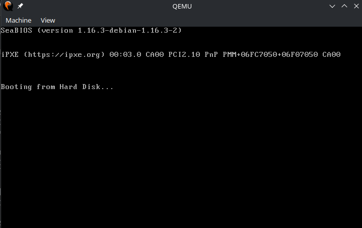
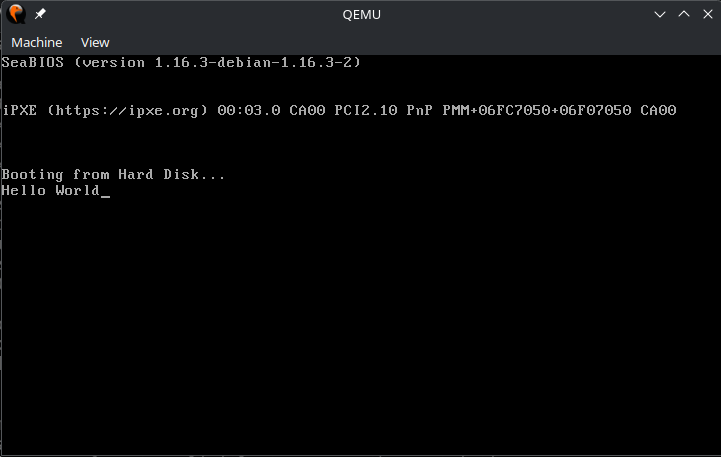

# sky-os
A CLI based operating system. This is a project so I learn how OSes interact with hardware. We are going to skip the beginner level topics like 'what is an OS', 'different types of OS', etc.

# Prerequisites
1. NASM compiler
2. A virtual machine (I'm using QEMU)
3. `gcc`
4. `dd`

# The Assembly Language (NASM x86)
Assembly is a low level language used to talk between the software and the hardware. It's a human readable langauge (not much readable as C) but this is how it looks like:<br>

```
mov ax, 10
```
The first part `mov` is the instruction itself, and `ax, 10` are parameters which are separated by a comma. This line of code assigs 10 to `ax`. `ax` is a register. Registers are inside your CPU which store data. They are capable of storing small amount of data. We will use them more later.

# How Does an OS Start?
When a computer is turned on, it first looks for an operating system. How does it know where the operating system is located? <br>
Computer finds a part in the memory called the "boot sector". The boot sector is the first sector of a bootable drive (which can be an HDD, SSD, or a pendrive). A boot sector is always about 512 bytes long that is written in binary code. These conditions make a sector a valid boot sector. The boot sector always ends with the hexadecimal number "55 aa". <br>
For example:
```
4d 72 20 44 61 6c 6c 69
          ...
61 72 64 21 20 41 55 aa
```
## Making a Boot Sector
A bootloader should always end with the hexadecimal number "55 aa", it should be 512 bytes long and it must be saved in `.bin` format.

### A little bit of Assembly
As assembly code is executed line by line, we must know more of its concepts. 
```
Lable:
  some code #1
  some code #2
  jmp anotherLable
  some code #3
anotherLable:
  some code #4
  jmp anotherLable
```
In C, although `goto` statements aren't really used, but `jmp` does the exact behavior like `goto` statement. `jmp` is used to jump to from one lable to another one. From the code, only `some code #1`, `some code #2` is executed while the `some code #3` is skipped because there is a `jmp` statement before code three. `some code #4` is going to be executed multiple times because there is a `jmp` statement calling `anotherLable` repeatly, making a loop.  <br>

Another way to make a loop is using the `$` character, where `$` is the current memory address. For example,
```
A:
  code #1
  code #2
  jmp $
```
### Coding the Bootloader
To make the code bootable, you need to write this specific code block.
```
jmp $
times 510-($-$$) db 0
db 0x55, 0xaa
```
- Our first line is not 512 bytes long, to make it so, we need to add a bunch of 0s to create some "fake bytes". <br>
- The `times` function is used to repeatedly run a code n number of times. In this case it runs for `510-($-$$)`. <br>
- `$$` represents the beginning of the current section. So the `$-$$` basically means "memory address - section start". So the result of this whole operation is going to be 512, and the `times` block is going to execute 512 times. 
- `db 0` means "define 0", just adds `0` in the code.
- `db 0x55 0xaa` means "define 55 and aa", adds `55` and `aa` so that represents the end of the bootloader. 

Save the code as `boot.asm` (yes, the name should be `boot.bin`), complile it to `boot.bin` using NASM complier like this:
```
nasm -f bin boot.asm -o boot.bin
```
Run the bootable file using this command:
```
qemu-system-x86_64 boot.bin
```
If everything works, you will see this: <br>
 <br>
Seeing this screen is normal because you just wrote only functioning of bootloader. Let's add some flavour later!

# BIOS (Basic Input/Output System)
Now we will actually make the computer do something. As you have booted last time, the computer switches to "Real Mode". It's a 16-bit mode assisted by "BIOS". BIOS provides us the tools to simply interact with the system (like printing characters, printing input from the keyboard and so on).  Let's learn how to print a character to the screen. 

## Character
1. Switch to teletype mode.

- Teletype Mode (TTY Mode): A text-rendering protocol where characters are output sequentially, one after another, at the current cursor position, automatically advancing the cursor and handling screen-wrapping or control characters (like newlines).

To do so, you need to use the `ax` register. See the code block for the `boot.asm` below.
```
mov ah, 0x0e           ; Set BIOS scrolling teletype function (write character to screen)
mov al, 'H'            ; Load the ASCII character 'H' into the AL register to be printed
int 0x10               ; Call the BIOS video services interrupt to execute the print
jmp $                  ; Jump to the current address ($), creating an infinite loop to halt execution
times 510-($-$$) db 0  ; Pad the rest of the 512-byte sector with zeros up to byte 510
db 0x55, 0xaa          ; Add the standard boot signature at bytes 511 and 512 so the BIOS recognizes it
```

This is going to print the letter H on the screen, now let's do the same for every letter in "Hello World!".


```
mov ah, 0x0e           ; Set BIOS scrolling teletype function (write character to screen)
mov al, 'H'            ; Load the ASCII character 'H' into the AL register to be printed
int 0x10               ; Call the BIOS video services interrupt to execute the print

mov ah, 0x0e
mov al, 'e'
int 0x10

mov ah, 0x0e
mov al, 'l'
int 0x10

mov ah, 0x0e
mov al, 'l'
int 0x10

mov ah, 0x0e
mov al, 'o'
int 0x10

mov ah, 0x0e
mov al, ' '
int 0x10

mov ah, 0x0e
mov al, 'W'
int 0x10

mov ah, 0x0e
mov al, 'o'
int 0x10

mov ah, 0x0e
mov al, 'r'
int 0x10

mov ah, 0x0e
mov al, 'l'
int 0x10

mov ah, 0x0e
mov al, 'd'
int 0x10

jmp $                  ; Jump to the current address ($), creating an infinite loop to halt execution
times 510-($-$$) db 0  ; Pad the rest of the 512-byte sector with zeros up to byte 510
db 0x55, 0xaa          ; Add the standard boot signature at bytes 511 and 512 so the BIOS recognizes it
```
You will then see something like this:



